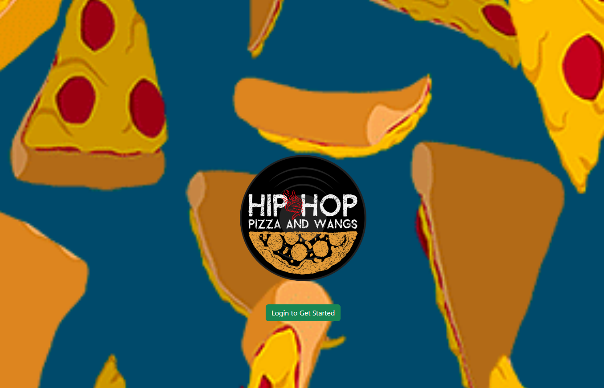

## HIP HOP, PIZZA AND WANGS (one last job group project)

VIEW APP TBA

# What is Hip Hop Pizza and Wangs
 A Ma and Pop resturant called Hip Hop, Pizza, and Wangs which has been in the community for over 30 years. HHP+W is a spot that you can take a meeting or hang out. Since the pandemic in 2020, they've had to change their business model and offer call in orders and business is booming. 

# About the User 
  The ideal Users for the app are the Employees at HHPW. This is a POS application for handling their increased volume of call in orders during the pandemic.

# Features
 - Login and logout with google
 - Create Orders
 - See all other Orders on the DOM
 - Add Items to Orders
 - Delete Items and Orders
 - Search for orders
 - Close Orders and add payment type and tip amount
 - View Total Revenue, Tips, Total Payment types, Date Added, And walk ins or call ins
 
# Video walkthrough of the App
 TBA

# Relevant Links
[Wireframes](https://www.figma.com/design/4y3EZddALuBR3ouSEM57Np/MVP?node-id=0-1)

# Contributors
[Cody Keener](https://github.com/codyKeener)
[Jimmy Fam](https://github.com/jmmyfam)
[Dustin Lawson](https://github.com/DWLAW)
[Julien Cain](https://github.com/juliencain)
[Andre Phosarath](https://github.com/AVP4000)
